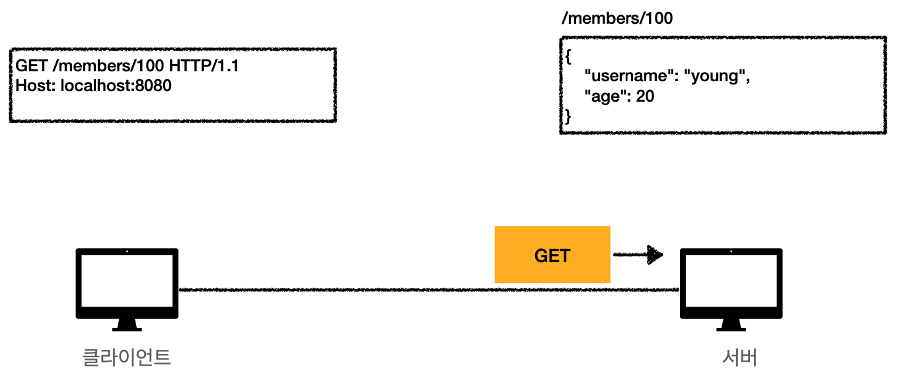
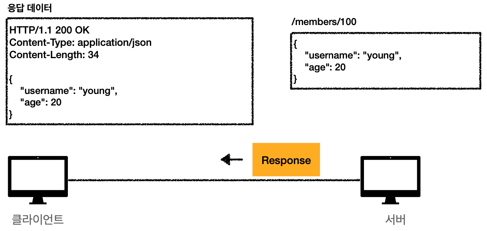
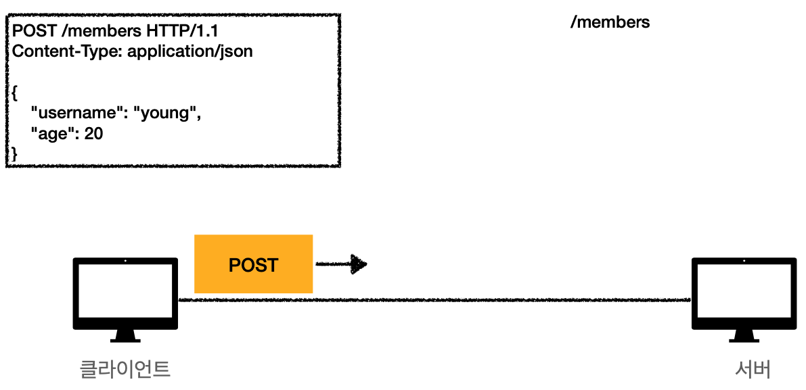
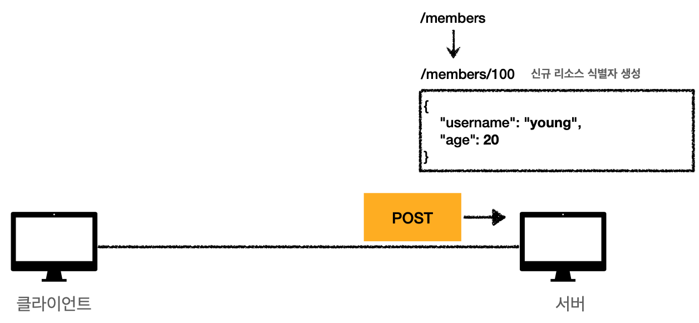
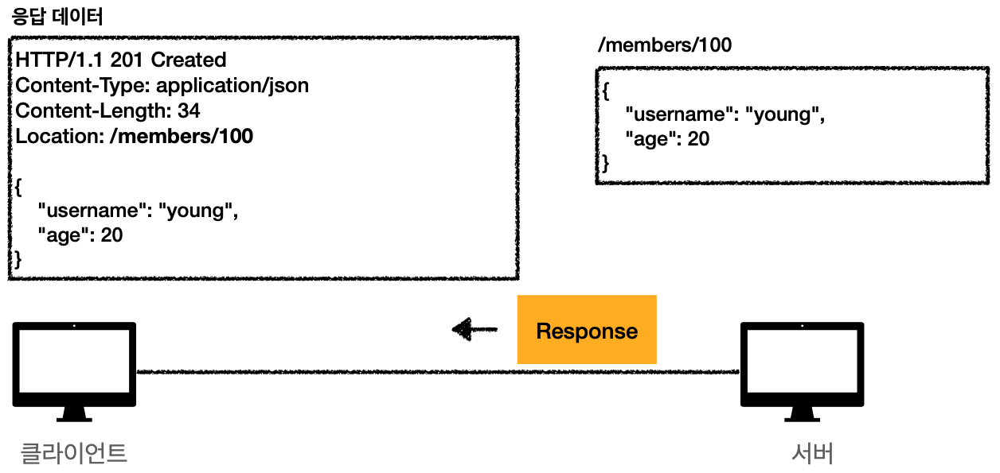
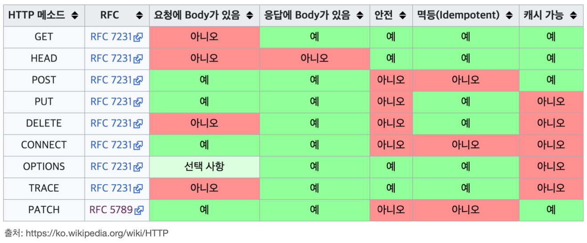

# HTTP 메서드

# HTTP API를 만들어보자

## 요구사항

- 회원 목록 조회
- 회원 조회
- 회원 등록
- 회원 수정
- 회원 삭제

## API URI 설계

URI(Uniform Resource Identifier)

- 회원 목록 조회 /read-member-list
- 회원 조회 /read-member-by-id
- 회원 등록 /create-member
- 회원 수정 /update-member
- 회원 삭제 /delete-member

## 이것은 좋은 URI 설계일까?

### 가장 중요한 것은 **리소스 식별**

- 리소스의 의미는 무엇일까?
    - 회원을 등록하고 수정하고 조회하는게 리소스가 아니다.
    - ex) ‘미네랄을 캐라’가 리소스가 아니고, ‘미네랄’이 리소스
    - **회원이라는 개념 자체가 리소스**
- 리소스를 어떻게 식별하는게 좋을까?
    - 회원을 등록하고 수정하고 조회하는 것을 모두 배제
    - **회원이라는 리소스만 식별하면 된다. → 회원 리소스를 URI에 맵핑**

## 수정한 API URI 설계

- **회원** 목록 조회 /members
- **회원** 조회 /members/{id}
- **회원** 등록 /members/{id}
- **회원** 수정 /members/{id}
- **회원** 삭제 /members/{id}

참고: 계층 구조상 상위를 컬렉션으로 보고 복수단어 사용 권장(member X, members O)

기능은 다른데 uri가 같아져버렸다.

**그런데 이것을 어떻게 구분하지??**

### 리소스와 행위를 분리

가장 중요한 것은 리소스를 식별하는 것

- **URI는 리소스만 식별!**
- **리소스**와 해당 리소스를 대상으로 하는 **행위**를 분리
    - 리소스: 회원
    - 행위: 조회, 등록, 삭제, 수정
- 리소스는 명사, 행위는 동사(미네랄을 캐라)
- 행위(메서드)는 어떻게 구분? ⇒ HTTP 메서드로 구분

# HTTP 메서드 - GET, POST

주요 메서드

- GET: 리소스 조회
- POST: 요청 데이터 처리, 주로 등록
- PUT: 리소스를 대체, 해당 리소스가 없으면 생성
- PATCH: 리소스 부분 변경
- DELETE: 리소스 삭제

기타 메서드

- HEAD: GET과 동일하지만 메시지 부분을 제외하고, 상태 줄과 헤더만 반환
- OPTIONS: 대상 리소스에 대한 통신 가능 옵션(메서드)을 설명(주로 CORS에서 사용)
- CONNECT: 대상 자원으로 식별되는 서버에 대한 터널을 설정
- TRACE: 대상 리소스에 대한 경로를 따라 메시지 루프백 테스트를 수행

## GET

```java
GET /search?q=hello&hl=ko HTTP/1.1
```

- 리소스 조회
- 서버에 전달하고 싶은 데이터는 query(쿼리 파라미터, 쿼리 스트링)을 통해서 전달
- 메시지 바디를 사용해서 데이터를 전달할 수 있지만, 지원하지 않는 곳이 많아서 권장하지 않음

메시지 전달 → 서버 도착 → 응답 데이터





## POST

```java
POST /members HTTP/1.1
```

- 요청 데이터 처리
- **메시지 바디를 통해 서버로 요청 데이터 전달**
- 서버는 요청 데이터를 **처리**
    - 메시지 바디를 통해 들어온 데이터를 처리하는 모든 기능을 수행한다.
- 주로 전달된 데이터로 신규 리소스 등록, 프로세스 처리에 사용

메시지 전달 → 신규 리소스 생성 → 응답 데이터





등록 후 신규 식별자를 반환



신규로 생성되면 보통 상태 코드를 201로 보내는데 200으로 보내도 상관은 없다.
그리고 헤더에 Location이라고 자원이 생성된 경로를 보내준다. + 등록된 자원의 데이터도 반환

### 요청 데이터를 어떻게 처리한다는 뜻일까?

- 스펙: POST 메서드는 **대상 리소스가 리소스의 고유한 의미 체계에 따라 요청에 포함된 표현을 처리하도록 요청**한다.
- 정리: 이 리소스 URI에  POST 요청이 오면 요청 데이터를 어떻게 처리할지 리소스마다 따로 정해야 함 → 정해진 것이 없다.
1. **새 리소스 생성(등록)**
    - 서버가 아직 식별하지 않은 새 리소스 생성
2. 요청 **데이터** 처리
    - 단순히 데이터를 생성하거나, 변경하는 것을 넘어서 프로세스를 처리해야 하는 경우
    - ex) 주문에서 결제완료 → 배달 시작 → 배달완료 처럼 단순히 값 변경을 넘어 프로세스의 상태가 변경되는 경우
    - POST의 결과로 새로운 리소스가 생성되지 않을 수도 있음
    - ex) POST /orders/{orderId}/start-delivery (컨트롤 URI)
3. **다른 메서드로 처리하기 애매한 경우**
    - ex) JSON으로 조회 데이터를 넘겨야 하는데, GET 메서드를 사용하기 어려운 경우
    - 애매하면 POST

**그렇다면 GET 같은걸 쓰지않고 그냥 다 POST로 보내면 되는거 아닌가?**

⇒ 조회는 GET을 사용한다고 서버끼리 약속도 되어있기도 하고, GET을 사용하면 캐싱이 쉬운 반면 POST를 사용하면 캐싱이 어렵다.

## PUT

```java
PUT /members/100 HTTP/1.1
```

- 리소스를 대체
    - 리소스가 있으면 대체, 없으면 생성
    - 쉽게 말해서 덮어쓰기
- **클라이언트가 리소스를 식별!**
    - 클라이언트가 리소스 위치를 알고 URI 지정
    - POST와 차이점

## PATCH

- 리소스 부분 변경
    - 변경된 부분만 골라서 변경

## DELETE

- 리소스 제거

# HTTP 메서드의 속성

- 안전(Safe Methods)
- 멱등(Idempotent Methods)
- 캐시가능(Cacheable Methods)



요즘엔 GET에 body를 넣을 수 있는데 사용할 수 있는 곳이 많지 않기 때문에 사용하지 않는게 좋다.

## 안전

- 호출해도 리소스를 변경하지 않는다.
- Q: 그래도 계속 호출해서, 로그 같은게 쌓여서 장애가 발생하면??
- A: 안전은 해당 리소스만 고려한다. 그런 부분까지 고려하지 않는다.

`GET`, `HEAD`는 단순 데이터 조회만 하기 때문에 한 번 호출하든, 여러 번 호출하든 안전

## 멱등

- f(f(x)) = f(x)
- 한 번 호출하든 두 번 호출하든 100번 호출하든 결과가 똑같다.

`GET`: 한 번 조회하든, 두 번 조회하든 같은 결과가 조회

`PUT`: 결과를 대체한다. 따라서 같은 요청을 여러 번 해도 최종 결과는 같다.(기존 것을 지우고 덮어써 버리므로)

`DELETE`: 결과를 삭제한다. 같은 요청을 여러 번 해도 삭제된 결과는 똑같다.(몇 번을 호출하든 한 번 이상 호출하면 해당 리소스는 삭제된 상태)

<aside>
⚠️ POST는 멱등이 아니다! 두 번 호출하면 같은 결제가 중복해서 발생할 수 있다.(2번 호출하면 2번 등록이 되버림)

</aside>

- 활용
    - 자동 복구 매커니즘
    - 서버가 TIMEOUT 등으로 정상 응답을 못주었을 때, 클라이언트가 같은 요청을 다시 해도 되는가? 판단 근거
      (DELETE 메소드를 보냈는데 서버에서 오류가 났다. 하지만 DELETE는 멱등성이므로 재요청해도 괜찮다.)

- Q: 재요청 중간에 다른 곳에서 리소스를 변경해버리면?
    - 사용자1: GET → username: A, age: 20
    - 사용자2: PUT → username: A, age: 30
    - 사용자1: GET → username: A, age: 30 → 사용자2의 영향으로 바뀐 데이터 조회
- **A: 멱등은 외부 요인으로 중간에 리소스가 변경되는 것 까지는 고려하지 않는다.**

## 캐시 가능 ⭐

- 응답 결과 리소스를 캐시해서 사용해도 되는가?
- GET, HEAD, POST, PATCH 캐시 가능
- 실제로는 `GET`, `HEAD` 정도만 캐시로 사용
    - POST, PATCH는 본문 내용까지 캐시 키로 고려해야 하는데, 구현이 쉽지 않음
      (POST는 body 안에 데이터도 고려해야해서 복잡한데, GET은 url만 키로 잡으면 되서 간편)