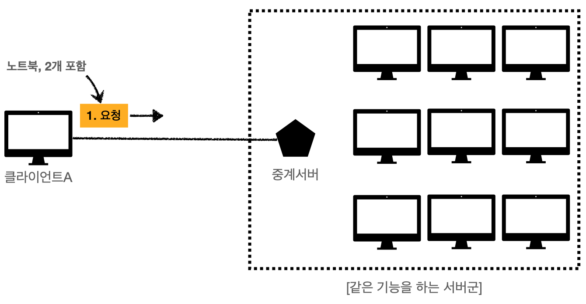
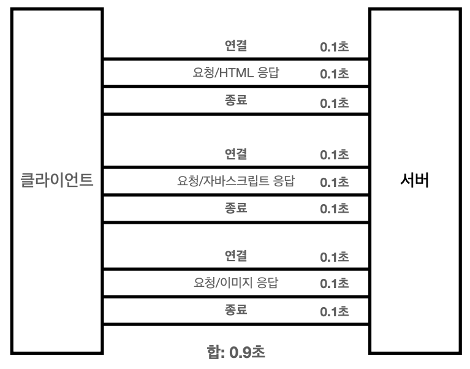
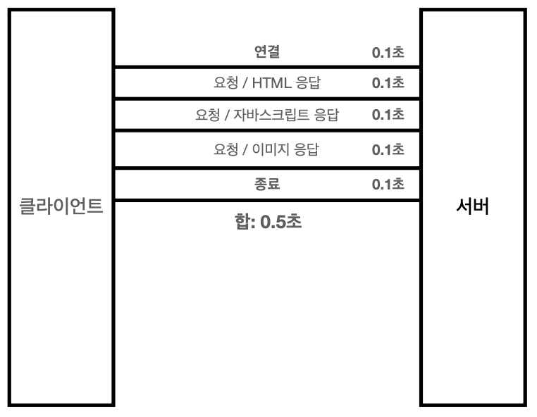
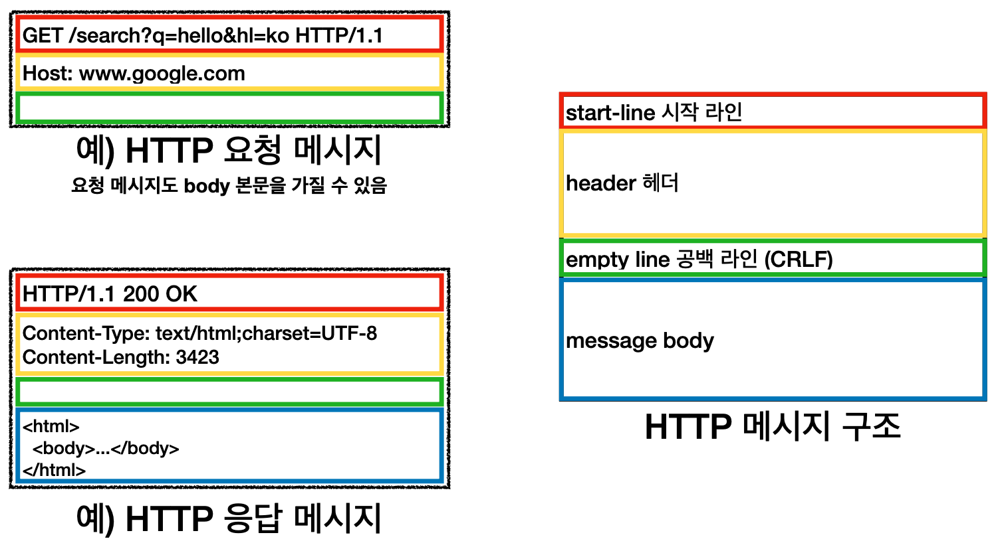

# HTTP 기본

# 모든 것이 HTTP

## HTTP 메시지에 모든 것을 전송

- HTML, TEXT, IMG, 음성, 영상, 파일, JSON, XML
- 거의 모든 형태의 데이터 전송 가능
- 서버간에 데이터를 주고 받을 때도 대부분 HTTP 사용

## HTTP 역사

HTTP/0.9 → HTTP/1.0 → HTTP/1.1 → HTTP/2 → HTTP/3(진행 중)

- 0.9에서는 GET 메서드만 지원. header X
- 1.0에서 메서드, header 추가
- 1.1은 가장 많이 사용하고 있는 버전
- 2와 3은 1.1의 성능 개선 버전. 특히 3은 TCP 대신 UDP 사용해서 빠르면서 데이터 양을 줄이고 커스텀이 가능

# HTTP의 특징

## 클라이언트 서버 구조

### Request Response 구조

- 클라이언트는 서버에 요청을 보내고, 응답을 대기
- 서버가 요청에 대한 결과를 만들어서 응답

## Stateful,  Stateless

### Stateful

- 상태 유지
    - 항상 같은 서버가 유지가 되어야 한다. 만약 내가 통신하던 서버가 장애가 나면 처음부터 다시 시작해야 함
    - 내가 물건을 사려고 할 때 중간에 다른 점원으로 바뀌면 상태 정보를 다른 점원에게 미리 알려줘야만 함

### Stateless

- 무상태
    - 처음부터 필요한 데이터를 모두 담아서 보내버리기 때문에 중간에 다른 점원으로 바뀌어도 상관 없음
    - 갑자기 고객이 증가해도 점원을 대거 투입할 수 있다.
    - 즉, 클라이언트 요청이 증가해도 서버를 대거 투입할 수 있다.
- 무상태는 응답 서버를 쉽게 바꿀 수 있다. → **무한한 서버 증설 가능**
    - 스케일 아웃 - 수평 확장 유리

      


### Stateless의 한계

- 데이터를 더 많이 보내야 한다.(노트북, 2개, 신용카드)
- 모든 것을 무상태로 설계할 수 있는 경우도 있고 없는 경우도 있다.
- 가능한 경우
    - ex) 로그인이 필요 없는 단순한 서비스 소개 화면
- 불가능한 경우
    - ex) 로그인
- 로그인한 사용자의 경우 로그인 했다는 상태를 서버에 유지
- 일반적으로 브라우저 쿠키와 서버 세션 등을 사용해서 상태 유지
- 상태 유지는 최소한만 사용

## 비연결성

TCP/IP는 기본적으로 연결을 유지한다.
이 방식은 클라이언트가 놀고 있어도 서버와 계속 연결이 되어있어서 서버의 자원을 불필요하게 소모하게 된다.

그래서 HTTP는 클라이언트가 요청을 해서 서버에게 응답을 받으면 연결을 끊어버린다.
이 방식은 서버에서 연결을 유지하지 않으므로, 최소한의 자원으로 유지할 수 있다.

- HTTP는 기본이 연결을 유지하지 않는 모델
- 일반적으로 초 단위 이하의 빠른 속도로 응답
- 1시간 동안 수천명이 서비스를 사용해도 실제 서버에서 동시에 처리하는 요청은 수십개 이하로 매우 작음
- 서버 자원을 매우 효율적으로 사용할 수 있음

### 비연결성의 한계

- TCP/IP 연결을 새로 맺어야 함 → 3 way handshake 시간 추가
- 웹 브라우저로 사이트를 요청하면 HTML 뿐만 아니라 자바스크립트, css, 추가 이미지 등등 수 많은 자원이 함께 다운로드

### 비연결성의 한계 극복

- 지금은 HTTP 지속 연결로 문제 해결(일정 시간 연결 유지)
- HTTP/2, HTTP/3에서 더 많음 최적화



HTTP 초기



HTTP 지속 연결

### 스테이트리스를 기억하자!

서버 개발자들이 어려워하는 업무 ⇒ 동시성 이슈

- 정말 같은 시간에 딱 맞추어 발생하는 대용량 트래픽
- ex) 선착순 이벤트, 명절 KTX 예약, 학과 수업 등록
- ex) 저녁 6:00 선착순 1000명 치킨 할인 이벤트 → 수만명 동시 요청

어떻게든 머리를 쥐어짜서 최대한 스테이스리스하게 설계를 하자!

## HTTP 메세지



공백 라인은 꼭 들어가야 한다.

### 시작 라인

요청 메시지

```java
GET /search?q=hello&hl=ko HTTP/1.1
```

- HTTP 메서드⭐ - GET, POST, PUT, DELETE, PETCH
- 요청 대상 - 절대 경로(”/”)로 시작하는 경로(http://와 같이 다른 유형의 경로지정 방법도 있다.)
- HTTP Version

응답 메시지

```java
HTTP/1.1 200 OK
```

- HTTP Version
- HTTP 상태 코드 - 요청의 성공, 실패를 나타냄
- 이유 문구 - 사람이 이해할 수 있는 짧은 상태 코드 설명 글

### HTTP 헤더

```java
Content-Type: text/html;charset=UTF-8
```

- 필드 네임 + ”: ” + 필드 벨류
- 콜론 앞에는 스페이스를 붙이지 않고, 콜론 뒤에 스페이스 하나를 붙여준다.
- 필드 네임은 대소문자를 구분하지 않지만, 필드 벨류는 대소문자를 구분 한다.
- 헤더는 HTTP 전송에 필요한 모든 부가정보가 들어있다.
  ex) 메시지 바디의 내용, 메시지 바디의 크기, 압축, 인증, 요청 클라이언트(브라우저) 정보, 서버 애플리케이션 정보, 캐시 관리 정보…
- 표준 헤더가 너무 많음
- 필요시 임의의 헤더 추가 가능

### HTTP 메시지 바디

```html
<html>
	<body>...</body>
</html>
```

- 실제 전송할 데이터
- HTML 문서, 이미지, 영상, JSON 등등 byte로 표현할 수 있는 모든 데이터 전송 가능

### 매우 단순함. 확장 가능

- HTTP는 단순하다. 스펙도 읽어볼만.
- HTTP 메시지도 매우 단순
- 크게 성공하는 표준 기술은 단순하지만 확장 가능한 기술

# HTTP 정리

- HTTP 메시지에 모든 것을 전송
- HTTP/1.1을 기준으로 학습
- 클라이언트 서버 구조
- 무상태 프로토콜(Stateless)
- HTTP 메시지
- 단순함, 확장 가능